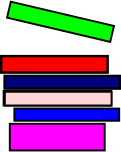

---

marp: true
theme: custom
math: mathjax

---

# 競プロ特訓会 No. 1

## 20251009

## コウタコ

---

## 目次 (1/2)

1. 一般的な話

* 目を使おう。紙を使おう。頭を使おう。（最初からVSCodeを見てしまうあなたへ。）
* オーダーの限界の目安とクエリ系問題の場合
* 矢印として見る配列、マップ
* よく使う関数

2. 私の場合

* 私のスニペット晒し
* long long使おう
* whileよりforが安定

---

## 目次 (2/2)

3. グラフと探索

* グラフとは
* キューとスタック
* DFS（深さ優先探索）
* BFS（幅優先探索）
* 貪欲法って何さ
* DP（動的計画法）

---

## 1. 一般的な話

---

## オーダーの限界の目安とクエリ系問題の場合

### オーダーの限界の目安

2秒だと、大体 **$O(10^{10})$** ぐらいが限界。
$N=2 \times 10^5$ とすると、**$O(N^2)$** は $O(4 \times 10^{10})$ ぐらいになるので、間に合わない。

### クエリ系問題の場合

N個の要素が最初に与えられて、その後Q個のクエリが送られてくるのでそれを処理しなさい、みたいな問題で、$0 \leq N, Q \leq 2 \times 10^6$とかだと、
**クエリを受け付ける時、計算は既に終わっているんだッ！**
という感じになっている必要がある。

---

## 目を使おう。紙を使おう。頭を使おう。（最初からVSCodeを見てしまうあなたへ。）

*「問題をパッと見てすぐコードを書き始める。」*
↑良くない！全然ダメなコードを書いて、結局1から書き直す羽目に、、、。

1. **問題をちゃんと読もう！**
   全然違う問題への答えを書いて、問題丸々1つ分ぐらいの時間を無駄にするぞ！
2. **パッと見て、良く分からなかったら、紙とかに書いて考えよう！**
私は紙嫌いなので、MSPaintに書いてます。ちょうどいいぐらいの機能と速さで、中々気に入ってる。テキストだと図が書けなくてあんまりよくない。
3. **結論: 頭を使え！**

---

## **矢印**として見る配列、マップ

あるデータから別のデータを得る時、この考え方を持っておくと分かりやすい気がする。
矢印は、その方向にデータを変換したい時に、高速で連れていってくれる。
**どんな変換をするのか考えて、事前に矢印を用意する。**←クエリ系問題

### 配列 = **インデックス→値**

例:

* 出席番号順番目のデータがその番号の人の名前になっている
  ↑**出席番号→名前**
* 名前に対して、その名前の人の成績が入っているマップ
  ↑**名前→成績**

---

## よく使う関数

皆が知ってるのは乗せても仕方ないので、ギリギリを攻めていく。

|関数|説明|
|-|-|
|pow|べき乗。これが無いと生きていけない。|
|max_element/min_element|配列の最大/小値の場所と値を教えてくれる。|
|lower_bound|2分探索してくれる。目当ての値が無くても動く優れもの。|

---

## 2. 私の場合

---

## 私のスニペット晒し (1/2)

```cpp
#define _GLIBCXX_DEBUG
#include <bits/stdc++.h>
using namespace std;
using ll = long long;
#define all(a) (a).begin(), (a).end()
using pos = pair<ll, ll>;

int main(void)
{
    
    return 0;
}
```

---

## 私のスニペット晒し (2/2)

```json
{
 "fori": {
  "prefix": "fori",
  "body": [
   "for (ll ${1:i} = 0; $1 < ${2:n}; $1++)"
  ]
 },
 "VectorInput": {
  "prefix": "VectorInput",
  "body": [
   "vector<${1:ll}> ${2:a}(${3:n});",
   "for (ll i = 0; i < $3; i++)",
   "    cin >> $2[i];",
   ""
  ]
 },
}
```

---

## long long使おう

### 皆さんは**int**を使っていますか？あれはカスや。（炎上ネタ）

**`long long`** を使うべきや、さすれば2度とオーバーフローなどせん。
`using ll = long long`でllで使えるようにしておくと楽。

### intとlong longの違い

デカさがちゃう。long longはintのざっと倍や。long longはオーバーフローなどせん。
それでオーバーフローするようならオシマイだからや。

---

## whileよりforが安定（炎上ネタ）

**`for (;ﾅﾝﾄｶ;)`** で`while(ﾅﾝﾄｶ)`は代用できる。
文字数も同じ、**拡張性は歴然**、はっきり言おう、**whileはカスや**。

どうせね、whileでやったってね、後から初期化と更新が欲しくてforに書き換えるんですよね。

クエリ処理だけ使ってるのはごめんなさい。だって綺麗なんだもん、、、。

```cpp
long long q;
cin >> q;
while (q--){
    ...
}
```

---

## 3. グラフと探索

---

## グラフとは

**複数の互いに関係を持つモノ**を抽象化した概念。元々は数学の概念なので、何ならグラフが専門の先生が高専に居る。
図の丸を**頂点 (Vertex)**、線を**辺 (Edge)** という。
頂点とか辺とかに数が付いたり、辺は一方通行の矢印になってたりする。

頂点$A_i$と頂点$B_i$を結ぶ辺がある、みたいな感じで入力が与えられるので、
2次元配列で、**ある頂点から辺が繋がっている頂点の配列の配列**に変換する。
辺が一方通行じゃないグラフは、それを双方向につなげる。


---

## キューとスタック

まあ、ざっくり言うと特殊な配列。動作が制限されているが、高速かつ効率的。

|名前|要素の追加|要素の取得、削除|
|-|-|-|
|キュー|端っこにだけできる。|入れた順番に**先**に入れた方から出せる。FIFO|
|スタック|〃|入れた順番に**後**に入れた方から出せる。LIFO|

 

---

## DFS（深さ優先探索）

行ける所まで深く行って、行き止まりにあたったら、直前にもどる。早く奥をみれるけど、手前の事が分かるのは遅い。
再帰またはスタックを使う。

### スタックでの例

1. もし行き止まりなら、スタックに入っている頂点の内1つにワープ。
2. 自分の今居る頂点から、まだ行った事の無い頂点をスタックに入れる。
3. その内1つに進み、1. に戻る。

というのを、スタックが空になるまで続ける。

---

## BFS（幅優先探索）

深い所から探索するDFSと違って、浅い所から優先的に探索する。
キューを使う。具体的には、DFSのスタックをキューに置き換えるだけ。

---

## 貪欲法って何さ

最終結果を最大化する時、常に結果が1番大きくなる選択を取り続けるアルゴリズム。
使える状況は限られるが、非常に速い。

---

## DP（動的計画法）

操作を進めていくと、途中で他のルートからたどってきた世界線と一致する事が多い場合に使う。最大値を求める問題はこれをまず疑うべき。
同じ状況で、より良い途中結果にたどり着いたら、それで上書きする。
これを使うと、$O(N^2)$かかっていた問題も$O(N)$とかでいけるようになる優れもの。
JOI 2次予選に出るらしい。
