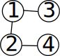
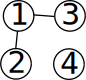

---

marp: true
theme: custom
math: mathjax

---

# 競プロ特訓会 No. 2

## 20251016

## コウタコ

---

## 今日の内容

* DFS
* BFS
* リクエストコーナー

あくまで、今日説明するのは1番シンプルな場合なので、実際はちょっと捻りが入ります。

---

## DFS - 例

### 問題

ここに迷路があり、この迷路には、1～Nまでの番号が振られたN個の交差点と、それらを結ぶ1～Mまでの番号が振られたM本の道があります。
たかし君がこの迷路の交差点1で目を覚まし、交差点Nから迷路の外へ出られる時、たかし君が迷路から出られるか判定してください。

### 入力

$N$ $M$
$A_0$ $B_0$
...
$A_{M-1}$ $B_{M-1}$

---

## DFS - 例

### テストケース

1:   2: 

* [再帰での実装（特定の状況でちょっと楽にかけるぐらい）](takashi_in_the_maze_with_recursion.cpp)
* [スタックでの実装（特に理由が無ければこっちを覚えるべき）](takashi_in_the_maze_with_stack.cpp)

---

## DFS - 問題を解いてみよう

[C - Count Connected Components (https://atcoder.jp/contests/abc284/tasks/abc284_c)](https://atcoder.jp/contests/abc284/tasks/abc284_c)

---

## BFS

スタックをキューにするだけ！

---

## リクエストコーナー

解けなかった問題を解いてみる、とか。

---

## クレジット

* [AtCoderの問題を分類しました【計算量・データ構造・アルゴリズム】 (https://zenn.dev/koyanagihitoshi/books/atcoder-classification-4)](https://zenn.dev/koyanagihitoshi/books/atcoder-classification-4)
